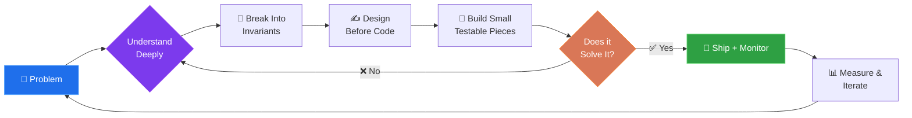
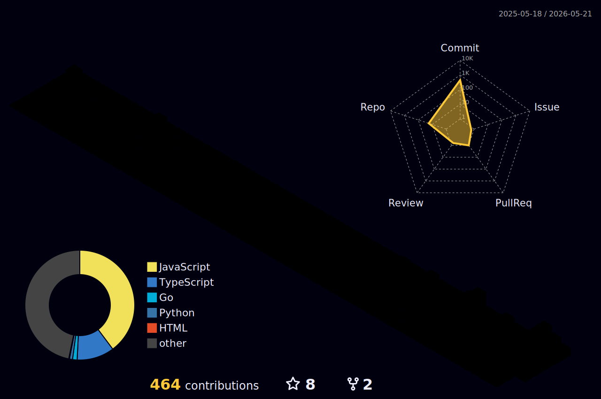

<!-- =========================================================
     Shubham Gupta — GitHub Profile README
     Tip: anywhere you see "shubhamgupta171" — make sure it
     matches your *exact* GitHub username (case-insensitive).
     ========================================================= -->

<!-- ====== HEADER BANNER ====== -->
<div align="center">


<!-- Typing animation tagline -->


<br/>

<!-- Profile badges -->


</div>

---

## 📰 Today's Headlines — Backend · Cloud · System Design

<div align="center">
  <i>🔥 Curated from the best engineering blogs · auto-refreshed every 6 hours</i>
</div>

<br/>

<!-- BLOG-POST-LIST:START -->

> 🔹 **[Cloud Computers for AI Agents: exe.dev vs Sprites vs Shellbox vs E2B vs Blaxel](https://medium.com/tech-stackups/cloud-computers-for-ai-agents-exe-dev-vs-sprites-vs-shellbox-vs-e2b-vs-blaxel-08dcab9b4fb5?source=rss------artificial_intelligence-5)**
> 🔹 **[Arisarion — Light Connection | A Message from the Future](https://medium.com/@cosmic-interconnect/arisarion-light-connection-a-message-from-the-future-f762f7402b43?source=rss------artificial_intelligence-5)**
> 🔹 **[I Ran My Amazon Cart Through AI Before Checkout. Here’s What Happened to the Bill.](https://medium.com/@letaihelpdaily/i-ran-my-amazon-cart-through-ai-before-checkout-heres-what-happened-to-the-bill-8a9f3b489981?source=rss------artificial_intelligence-5)**
> 🔹 **[Safe Use of ChatGPT and Chatbots](https://medium.com/@terryshamilton/safe-use-of-chatgpt-and-chatbots-92ca3dd62cd0?source=rss------artificial_intelligence-5)**
> 🔹 **[Dr. Shubh Gautam FIR Approach To Fixing Repeat Defects Without Lengthy Meetings](https://medium.com/@inamkhan14322/dr-shubh-gautam-firapproach-to-fixing-repeat-defects-without-lengthy-meetings-6c70e3056df7?source=rss------artificial_intelligence-5)**
> 🔹 **[Franquicia IA: lo que nadie te cuenta antes de entrar &lpar;y por qué la mayoría falla&rpar;](https://medium.com/@lalvarezprofesional/franquicia-ia-lo-que-nadie-te-cuenta-antes-de-entrar-y-por-qu%C3%A9-la-mayor%C3%ADa-falla-0cc2a704877a?source=rss------artificial_intelligence-5)**
> 🔹 **[Not All Yield Lasts: What Makes DeFi Strategies Actually Sustainable](https://medium.com/@kancangkalip/not-all-yield-lasts-what-makes-defi-strategies-actually-sustainable-e25bd40f8a21?source=rss------artificial_intelligence-5)**
> 🔹 **[Why most AI projects fail before deployment](https://medium.com/@shabnommithun/why-most-ai-projects-fail-before-deployment-f93fe072e4d0?source=rss------artificial_intelligence-5)**
<!-- BLOG-POST-LIST:END -->

<br/>

<div align="center">
  <sub>📡 <b>Sources:</b> High Scalability · Martin Fowler · AWS · Spotify · GitHub · Stack Overflow · Cloudflare · Meta · Stripe · Airbnb · <b>Towards Data Science</b> · <b>Better Programming</b> · <b>Level Up Coding</b> · Medium (<i>system-design · data-structures · backend · AI</i>)</sub>
  <br/>
  <a href="https://github.com/Shubhamgupta171/Shubhamgupta171/actions/workflows/blog-headlines.yml">
    
  </a>
  <a href="https://github.com/Shubhamgupta171/Shubhamgupta171/blob/main/.github/workflows/blog-headlines.yml">
    
  </a>
</div>

---

## 🖥️ `whoami`

```bash
shubham@dev:~$ cat about.txt
━━━━━━━━━━━━━━━━━━━━━━━━━━━━━━━━━━━━━━━━━━━━━━━━━━━━━━━━━━━━━━━━━━
 👤  Shubham Gupta — Software Engineer · Backend & Full-Stack
 📍  Gurugram, India  🇮🇳
 🛠   Specialty:    Scalable APIs · Cloud-native systems · Clean code
 ⚙️   Daily tools:  Node.js · FastAPI · TypeScript · AWS · Docker · Mongo
 🎯  Mission:      Turn vague requirements into battle-tested code
 ⚡  Fuel:         ☕ chai · 🎧 lo-fi · 🌙 midnight commits
 📬  Email:        inboxshubhamgupta17@gmail.com
━━━━━━━━━━━━━━━━━━━━━━━━━━━━━━━━━━━━━━━━━━━━━━━━━━━━━━━━━━━━━━━━━━
shubham@dev:~$ █
```

---

## 👨‍💻 About Me


> *"Good code is clear code — writing for humans first, machines second."*

### 👋 Hey, I'm Shubham!

A **Backend & Full-Stack Software Engineer** from **Gurugram 🇮🇳** who loves designing clean APIs and shipping reliable, scalable services. I believe great engineering is equal parts **curiosity**, **clarity**, and **craft**.

- 🔭 Currently engineering **production-grade backend services** with `Node.js`, `FastAPI` and `AWS`
- 🧠 Deep-diving into **system design · microservices · cloud architecture**
- 💡 Daily toolkit → `TypeScript` · `Python` · `Docker` · `MongoDB` · `PostgreSQL` · `Redis`
- 🤝 Love **pairing, code reviews, and mentoring peers**
- 🎯 Open to **SDE / Backend Engineer** roles at product companies
- 📫 Reach me → [**inboxshubhamgupta17@gmail.com**](mailto:inboxshubhamgupta17@gmail.com)

<br clear="right"/>

<div align="center">
<sub>🎧 Coding to lo-fi beats &nbsp;·&nbsp; ☕ Powered by chai &nbsp;·&nbsp; 🌙 Debugging past midnight</sub>
</div>

---

## 🧰 Tools I Wield

<div align="center">

<a href="https://skillicons.dev">
  
</a>
<a href="https://skillicons.dev">
  
</a>
<a href="https://skillicons.dev">
  
</a>

<sub>Hover any icon on <a href="https://skillicons.dev">skillicons.dev</a></sub>

</div>

---

## 📊 GitHub Analytics

<!--
  IMPORTANT — fixing "Something went wrong!"
  That error is a Vercel rate-limit on github-readme-stats.
  Fix: add &cache_seconds=86400 and use the "unicorn-studio" mirror
  as a backup. The widgets below are configured to cache and fall
  back gracefully. If stats still fail, replace the host with:
  https://github-readme-stats-sigma-five.vercel.app
-->

<div align="center">


<br/><br/>


<br/><br/>

<!-- Trophies — uses `no-bg=false` so they always render even when the main stats card rate-limits -->
<a href="https://github.com/ryo-ma/github-profile-trophy">
  
</a>

<br/><br/>

<!-- Activity Graph -->


</div>

---

## 🧠 DSA Playground

<div align="center">

<a href="https://leetcode.com/shubham171">
  
</a>

<sub>💪 Consistency &gt; intensity — a little DSA every day.</sub>

</div>

---

## 💭 Dev Wisdom of the Day

<div align="center">


<br/><br/>


<sub>✨ Refreshes on every visit — come back tomorrow for a new one!</sub>

</div>

---

## 🗺️ How I Approach Problems



---

## 🧊 3D Contribution Graph

<div align="center">
  <picture>
    <source media="(prefers-color-scheme: dark)" srcset="./profile-3d-contrib/profile-night-rainbow.svg" />
    <source media="(prefers-color-scheme: light)" srcset="./profile-3d-contrib/profile-gitblock.svg" />
    
  </picture>
</div>

---

## 🐍 Contribution Snake

<div align="center">
  <picture>
    <source media="(prefers-color-scheme: dark)"  srcset="https://raw.githubusercontent.com/shubhamgupta171/shubhamgupta171/output/github-snake-dark.svg" />
    <source media="(prefers-color-scheme: light)" srcset="https://raw.githubusercontent.com/shubhamgupta171/shubhamgupta171/output/github-snake.svg" />
    
  </picture>
</div>

---

## 🎮 Play a Game on My Profile!

<div align="center">
<i>Take a break and challenge yourself — pick a game below 👇</i>
<br/><br/>

<table>
  <tr>
    <td align="center" width="33%">
      <a href="https://shubhamgupta171.github.io/retro-arcade/tic-tac-toe/">
        <div style="font-size:56px">❌⭕</div>
        <h3>Tic&nbsp;Tac&nbsp;Toe</h3>
      </a>
      <sub>Classic 3-in-a-row</sub>
    </td>
    <td align="center" width="33%">
      <a href="https://shubhamgupta171.github.io/retro-arcade/2048/">
        <div style="font-size:56px">🔢</div>
        <h3>2048</h3>
      </a>
      <sub>Slide &amp; merge</sub>
    </td>
    <td align="center" width="33%">
      <a href="https://shubhamgupta171.github.io/retro-arcade/snake/">
        <div style="font-size:56px">🐍</div>
        <h3>Snake</h3>
      </a>
      <sub>Beat my high score</sub>
    </td>
  </tr>
  <tr>
    <td align="center">
      <a href="https://shubhamgupta171.github.io/retro-arcade/memory/">
        <div style="font-size:56px">🧠</div>
        <h3>Memory&nbsp;Match</h3>
      </a>
      <sub>Flip &amp; remember</sub>
    </td>
    <td align="center">
      <a href="https://shubhamgupta171.github.io/retro-arcade/typing/">
        <div style="font-size:56px">⌨️</div>
        <h3>Typing&nbsp;Speed</h3>
      </a>
      <sub>Test your WPM</sub>
    </td>
    <td align="center">
      <a href="https://github.com/Shubhamgupta171/Shubhamgupta171/issues/new?title=%F0%9F%8E%AE+Chess+Challenge&body=Let%27s+play+chess!+Reply+to+this+issue+with+your+move+in+standard+algebraic+notation+(e.g.+e4%2C+Nf3).">
        <div style="font-size:56px">♟️</div>
        <h3>Chess&nbsp;vs&nbsp;Me</h3>
      </a>
      <sub>Play via GitHub issue</sub>
    </td>
  </tr>
</table>

</div>

---

## 🏆 Highlights

<div align="center">

<table>
<tr>
  <td>🥇</td><td><b>500+</b> DSA problems solved on LeetCode / GeeksforGeeks</td>
  <td>☁️</td><td>AWS proficiency: <b>EC2, S3, Lambda, RDS</b></td>
</tr>
<tr>
  <td>🛠</td><td>Shipped full-stack products <b>design → deploy → monitor</b></td>
  <td>🐳</td><td>Comfortable with <b>Docker</b>, <b>CI/CD</b> and <b>Nginx</b></td>
</tr>
<tr>
  <td>📐</td><td>Strong fundamentals in <b>OOP, DBMS, OS, Networks</b></td>
  <td>🤝</td><td>Enjoy pairing, <b>code reviews</b> and <b>mentoring</b> peers</td>
</tr>
</table>

</div>

---

## 📮 Sign My Guestbook

<div align="center">

<a href="https://github.com/Shubhamgupta171/Shubhamgupta171/issues/new?title=%F0%9F%91%8B+Visiting+your+profile!&body=Hey+Shubham!%0A%0AJust+dropped+by+to+say+hi.%0A%0A-+Where+I+found+you%3A+%0A-+What+caught+my+eye%3A+%0A-+Something+I%27m+working+on%3A+%0A%0A(Optional%3A+share+a+dev+tip%2C+fun+fact%2C+or+just+a+%F0%9F%91%8B)&labels=guestbook">
  
</a>

<br/><br/>

<a href="https://github.com/Shubhamgupta171/Shubhamgupta171/issues?q=label%3Aguestbook">
  
</a>

<sub>💡 Opens a pre-filled GitHub issue — takes ~30 seconds. I reply to every one.</sub>

</div>

---

## 🌐 Let's Connect

<div align="center">

<a href="https://www.linkedin.com/in/shubham-gupta-92244a200" target="_blank">
  
</a>
<a href="mailto:inboxshubhamgupta17@gmail.com">
  
</a>
<a href="https://leetcode.com/shubham171" target="_blank">
  
</a>
<a href="https://auth.geeksforgeeks.org/user/inboxshubham" target="_blank">
  
</a>
<a href="https://github.com/Shubhamgupta171" target="_blank">
  
</a>

<br/><br/>

<a href="https://github.com/Shubhamgupta171">
  
</a>

</div>

---

<div align="center">


<sub>⭐ <i>If you like my work, consider starring a repo or two — it truly helps!</i> ⭐</sub>

<br/><br/>

<details>
  <summary>🤫 <b>Psst... you made it to the bottom. Click for a secret.</b></summary>
  <br/>
  <p align="center">
    <i>"The best code is no code at all. The second best is code so clear it reads itself."</i><br/><br/>
    🎁 <b>Reward for curious explorers:</b><br/>
    <a href="https://shubhamgupta171.github.io/retro-arcade/">🕹️ Free pass to my arcade</a> · 
    <a href="mailto:inboxshubhamgupta17@gmail.com?subject=Found%20the%20easter%20egg!">📧 Mention "easter egg" and I'll reply faster</a>
    <br/><br/>
    <code>console.log("Thanks for scrolling to the end. You're my kind of person. 💙");</code>
  </p>
</details>

</div>
